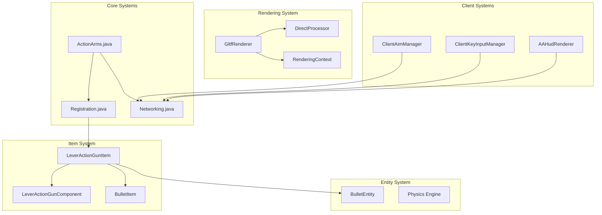
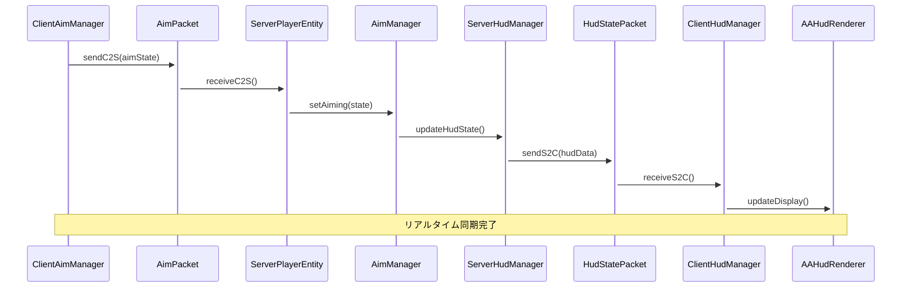
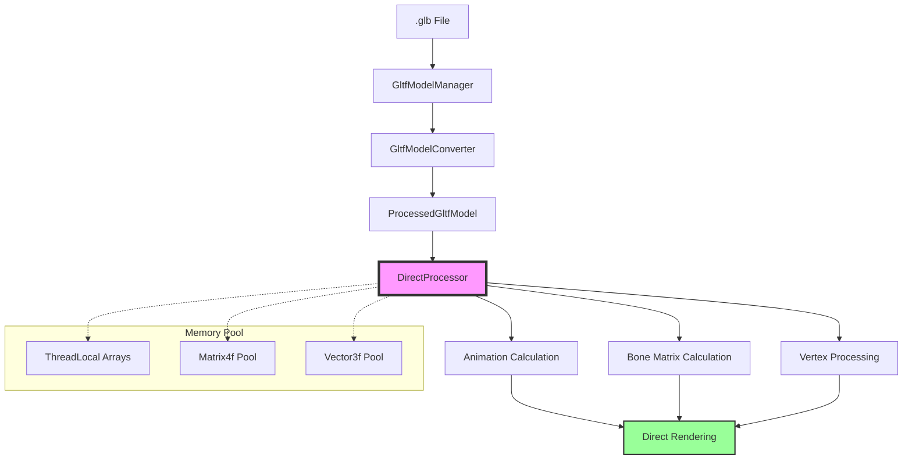
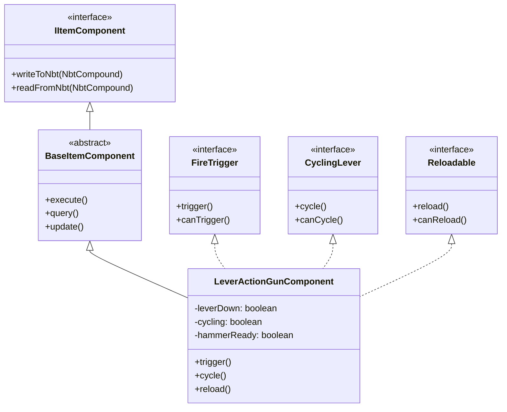
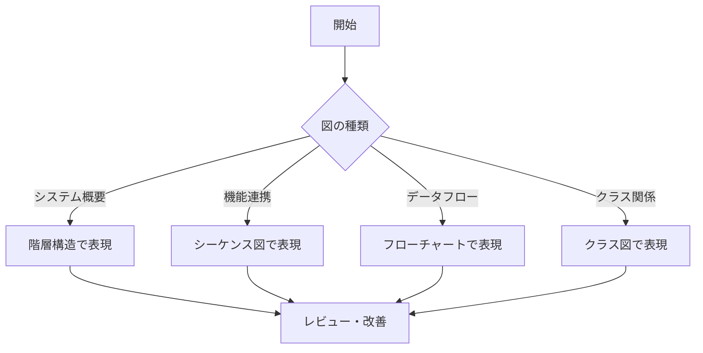

# ActionArms アーキテクチャ図作成ガイドライン

## 概要

このガイドラインは、ActionArms MODプロジェクトにおけるアーキテクチャ図の作成標準を定義します。知識の泉の依存関係情報を活用し、システムの構造を視覚的に表現する方法を提供します。

## 基本方針

### 1. 図の目的別分類

```
システム概要図: プロジェクト全体の構造
機能連携図: 特定機能の詳細フロー
データフロー図: データの流れと変換
クラス関係図: クラス間の依存関係
```

### 2. 使用ツール

**推奨**: Mermaid記法（Markdown対応）
**理由**: GitHubで直接表示可能、テキストベースで管理しやすい

## 図の種類と作成方法

### 1. システム概要図

#### 対象
- プロジェクト全体の構造把握
- 新規開発者向けオンボーディング
- 主要システム間の関係表現

#### 作成手順
1. `files-index.json`で主要カテゴリを抽出
2. `importance: high`のシステムを特定
3. システム間の依存関係を整理
4. 階層構造で表現

#### 例: ActionArms 全体システム図



### 2. 機能連携図

#### 対象
- 特定機能の詳細フロー
- 複数システム間の連携
- バグ調査時の影響範囲把握

#### 例: エイム機能の同期システム



### 3. データフロー図

#### 対象
- データの変換過程
- コンポーネントシステムの流れ
- パフォーマンス最適化の理解

#### 例: glTFレンダリングのデータフロー



### 4. クラス関係図

#### 対象
- インターフェース実装関係
- 継承構造
- 依存注入パターン

#### 例: コンポーネントシステムのクラス構造



## 図作成の実践手順

### Step 1: 知識の泉からの情報抽出

```bash
# 対象システムの特定
1. files-index.jsonで関連カテゴリを確認
2. 該当するcommon/*.jsonで詳細情報を取得
3. dependenciesフィールドから関係性を抽出
```

### Step 2: 図の種類決定

```
質問: 何を表現したいか？
- 全体構造 → システム概要図
- 処理の流れ → 機能連携図
- データの変換 → データフロー図  
- クラス設計 → クラス関係図
```

### Step 3: 情報の整理

```
優先度付け:
1. importance: high のコンポーネント
2. 直接的な依存関係
3. 重要なデータフロー
4. ユーザーインタラクション
```

### Step 4: 図の作成



## 図の品質基準

### 1. 明確性チェックリスト

- [ ] 目的が明確に表現されている
- [ ] 重要な要素が適切に強調されている
- [ ] 関係性が論理的に表現されている
- [ ] 適切な詳細レベルで描かれている

### 2. 保守性チェックリスト

- [ ] Mermaid記法で記述されている
- [ ] テキストベースで管理されている
- [ ] バージョン管理に適している
- [ ] 更新が容易な構造になっている

### 3. 有用性チェックリスト

- [ ] 開発者の理解を助ける
- [ ] 新規参加者のオンボーディングに有用
- [ ] デバッグ・トラブルシューティングに活用できる
- [ ] 設計議論の基盤として使える

## 実際の適用例

### 新機能開発時

```
1. 類似機能のアーキテクチャ図を参照
2. 新機能の影響範囲を図で確認
3. 設計レビューで図を活用
4. 実装完了後に図を更新
```

### バグ調査時

```
1. 問題箇所を含むシステム図を確認
2. データフロー図で問題の波及範囲を特定
3. 修正方針を図で検討
4. 修正後の構造を図で確認
```

### パフォーマンス改善時

```
1. 現在のデータフロー図を作成
2. ボトルネックを図で特定
3. 改善案を図で検討
4. Before/After比較図を作成
```

## 図の管理と更新

### 配置場所

```
docs/
├── architecture/
│   ├── system-overview.md      # システム概要図
│   ├── feature-flows/          # 機能連携図
│   ├── data-flows/             # データフロー図
│   └── class-diagrams/         # クラス関係図
└── agent/
    ├── files-index.json        # 図作成の情報源
    └── common/*.json
```

### 更新タイミング

```
必須更新:
- 重要なシステム変更時
- 新機能追加時
- アーキテクチャ変更時

推奨更新:
- 月1回の定期見直し
- リリース前の一括更新
- 大きなリファクタリング後
```

### バージョン管理

```
ファイル名規則:
- system-overview-v1.0.md
- aim-system-flow-v2.1.md
- gltf-data-flow-v3.0.md

変更履歴:
各図ファイルの先頭に変更履歴を記載
```

## まとめ

このガイドラインにより、ActionArms MODプロジェクトのアーキテクチャを視覚的に表現し、開発効率の向上と知識共有を実現します。知識の泉と連携した図作成により、常に最新で正確なアーキテクチャドキュメントを維持できます。

**重要なポイント**:
1. **目的に応じた図の選択**: 表現したい内容に最適な図形式を選択
2. **知識の泉との連携**: 依存関係情報を活用した正確な図作成
3. **継続的な更新**: システム変更に合わせた図の保守
4. **実用性重視**: 開発・デバッグに実際に役立つ図の作成

---
*視覚的理解により、複雑なシステムをシンプルに*