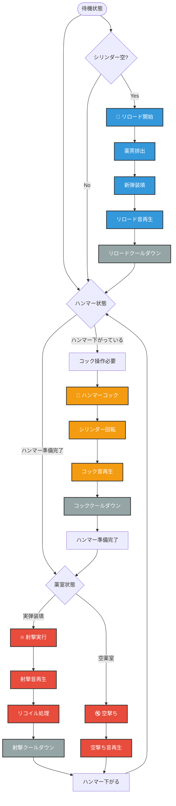
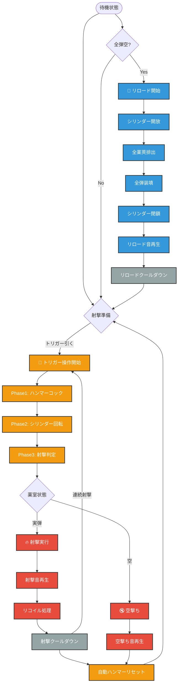
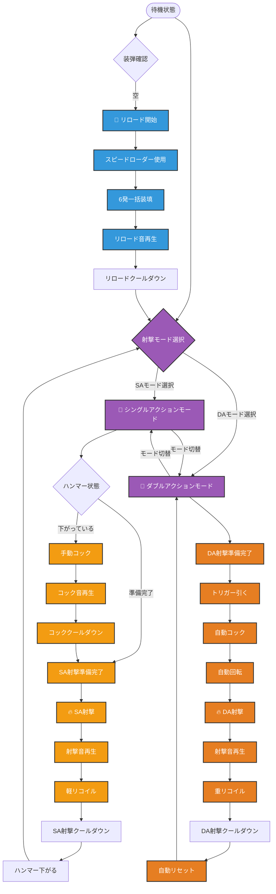
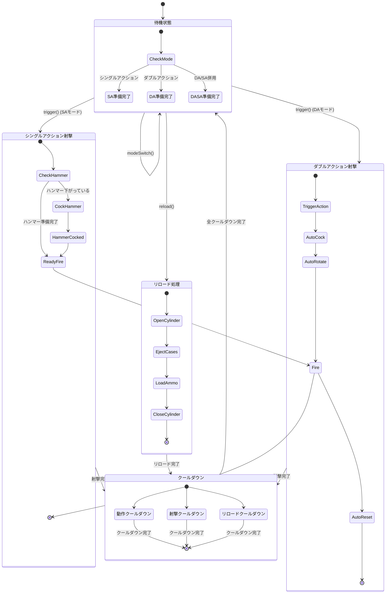

/clear
# リボルバー銃システム仕様提案書

## 概要
ActionArms MODに追加するリボルバー3機種の動作メカニズムと実装仕様を定義した技術提案書。各機種の特徴的な射撃システムと内部構造を詳細に設計し、既存のコンポーネントシステムとの統合方針を示す。

**作成日**: 2025-06-21  
**対象システム**: RevolverComponent.java およびその関連コンポーネント  
**提案範囲**: 3種類のリボルバー機構・動作フロー・パラメータ設定・実装アーキテクチャ

---

## 1. リボルバー機種仕様

### 1.1 シングルアクション・リボルバー (SAA1873)

#### 基本概念
19世紀後期の代表的なリボルバー。ハンマーを手動でコックしてからトリガーを引く2段階操作が特徴。

#### 動作フロー


#### パラメータ設定
```java
record SAARevolverDataType(
    float cockLength,              // ハンマーコック時間 (15tick = 0.75秒)
    float cockCoolLength,          // コック後クールダウン (5tick = 0.25秒)  
    float fireCoolLength,          // 射撃後クールダウン (8tick = 0.4秒)
    float reloadLength,            // リロード時間 (60tick = 3.0秒)
    float reloadCoolLength,        // リロード後クールダウン (10tick = 0.5秒)
    int cylinderCapacity,          // シリンダー装弾数 (6発)
    float baseSpreadAngle,         // 基本拡散角 (2.0度)
    float aimSpreadAngle,          // エイム時拡散角 (0.5度)
    float movementSpreadIncrease   // 移動時拡散増加 (1.5度)
)
```

### 1.2 ダブルアクション・リボルバー (DA38)

#### 基本概念
トリガー操作のみで連続射撃が可能。ハンマーコック・シリンダー回転・射撃を一連の動作で実行。

#### 動作フロー  


#### パラメータ設定
```java
record DARevolverDataType(
    float triggerPullLength,       // トリガー操作時間 (12tick = 0.6秒)
    float fireCoolLength,          //射撃後クールダウン (6tick = 0.3秒)
    float rapidFireCoolLength,     // 連続射撃間隔 (4tick = 0.2秒)
    float reloadLength,            // リロード時間 (40tick = 2.0秒)  
    float reloadCoolLength,        // リロード後クールダウン (8tick = 0.4秒)
    int cylinderCapacity,          // シリンダー装弾数 (6発)
    float baseSpreadAngle,         // 基本拡散角 (3.5度)
    float aimSpreadAngle,          // エイム時拡散角 (1.2度)
    float movementSpreadIncrease,  // 移動時拡散増加 (2.0度)
    float rapidFireSpreadIncrease  // 連続射撃時拡散増加 (1.0度)
)
```

### 1.3 DA/SA併用リボルバー (DASP357)

#### 基本概念  
シングルアクションとダブルアクションの両方の射撃モードを選択可能。精密射撃と速射の両方に対応。

#### 動作フロー


#### パラメータ設定
```java
record DASARevolverDataType(
    // シングルアクションモード
    float saCockLength,            // SAコック時間 (10tick = 0.5秒)
    float saCockCoolLength,        // SAコッククールダウン (3tick = 0.15秒)
    float saFireCoolLength,        // SA射撃クールダウン (5tick = 0.25秒)
    float saSpreadAngle,           // SA時拡散角 (0.8度)
    
    // ダブルアクションモード  
    float daTriggerPullLength,     // DAトリガー時間 (15tick = 0.75秒)
    float daFireCoolLength,        // DA射撃クールダウン (8tick = 0.4秒)
    float daSpreadAngle,           // DA時拡散角 (2.5度)
    
    // 共通パラメータ
    float reloadLength,            // リロード時間 (35tick = 1.75秒)
    float reloadCoolLength,        // リロード後クールダウン (6tick = 0.3秒)
    int cylinderCapacity,          // シリンダー装弾数 (6発)
    float modeSwitchTime,          // モード切替時間 (8tick = 0.4秒)
    float baseSpreadAngle,         // 基本拡散角 (1.5度)
    float aimSpreadAngle,          // エイム時拡散角 (0.3度)
    float movementSpreadIncrease   // 移動時拡散増加 (1.2度)
)
```

---

## 2. 内部構造とデータフロー

### 2.1 リボルバー共通構造
```mermaid
graph TD
    subgraph "リボルバー内部構造"
        Cylinder[シリンダー<br/>RevolverCylinder]
        Hammer[ハンマー状態<br/>hammerState]
        Trigger[トリガー状態<br/>triggerState]
        Ejector[排出機構<br/>ejectorState]
    end
    
    subgraph "弾薬システム"
        Chambers[薬室x6<br/>ChamberArray]
        Cartridges[薬莢管理<br/>CartridgeArray]  
        Bullets[弾丸データ<br/>BulletComponent]
        AmmoInventory[インベントリ弾薬<br/>InventoryAmmoUtil]
    end
    
    subgraph "タイミング制御"
        ActionTime[動作時間<br/>actionTime]
        CoolTime[クールダウン<br/>coolTime]
        ReloadTime[リロード時間<br/>reloadTime]
        ModeTime[モード切替時間<br/>modeTime]
    end
    
    subgraph "状態管理"
        ActionType[動作タイプ<br/>SA/DA/DASA]
        CurrentMode[現在モード<br/>currentMode]
        Cycling[動作中フラグ<br/>cycling]
        Reloading[リロード中<br/>reloading]
    end
    
    %% Data Flow
    Cylinder --> Chambers : 順次アクセス
    Chambers --> Cartridges : 薬莢状態管理
    Cartridges --> Bullets : 弾丸包含
    
    AmmoInventory --> Chambers : リロード時供給
    
    Hammer --> Trigger : 動作連携
    Trigger --> Cylinder : 回転制御
    
    %% Timing Control
    ActionTime --> Hammer : 動作タイミング
    CoolTime --> Trigger : 射撃間隔制御
    ReloadTime --> Ejector : リロード制御
    ModeTime --> CurrentMode : モード切替制御
    
    %% State Management
    ActionType --> CurrentMode : モード決定
    Cycling --> ActionTime : 動作進行管理
    Reloading --> ReloadTime : リロード進行管理
    
    %% Flow colors
    classDef structure fill:#e74c3c,stroke:#333,stroke-width:2px,color:#fff
    classDef ammo fill:#3498db,stroke:#333,stroke-width:2px,color:#fff
    classDef timing fill:#f39c12,stroke:#333,stroke-width:2px,color:#fff
    classDef state fill:#9b59b6,stroke:#333,stroke-width:2px,color:#fff
    
    class Cylinder,Hammer,Trigger,Ejector structure
    class Chambers,Cartridges,Bullets,AmmoInventory ammo
    class ActionTime,CoolTime,ReloadTime,ModeTime timing
    class ActionType,CurrentMode,Cycling,Reloading state
```

### 2.2 シリンダー管理システム
```java  
// シリンダー配列による薬室管理
record RevolverCylinder(
    ChamberState[] chambers,        // 6つの薬室状態
    int currentPosition,            // 現在の射撃位置
    boolean isOpen                  // シリンダー開放状態
) {
    // 次の薬室へ回転
    public RevolverCylinder rotate() {
        return new RevolverCylinder(
            chambers,
            (currentPosition + 1) % chambers.length,
            isOpen
        );
    }
    
    // 現在薬室の取得
    public ChamberState getCurrentChamber() {
        return chambers[currentPosition];
    }
}
```

---

## 3. ステートマシン構造

### 3.1 共通ステートマシン


---

## 4. 実装アーキテクチャ

### 4.1 クラス設計
```java
public abstract class RevolverComponent implements IItemComponent {
    // 共通状態
    protected RevolverCylinder cylinder;
    protected HammerState hammerState;
    protected float actionTime;
    protected float coolTime;
    protected boolean cycling;
    protected boolean reloading;
    
    // 抽象メソッド（各リボルバーで実装）
    public abstract ComponentResult trigger(ExecuteFunction.Context context);
    public abstract ComponentResult reload(ExecuteFunction.Context context);
    public abstract boolean canTrigger();
    public abstract boolean canReload();
}

// シングルアクション実装
public class SAARevolverComponent extends RevolverComponent {
    private boolean hammerCocked;
    private float cockTime;
    
    @Override
    public ComponentResult trigger(ExecuteFunction.Context context) {
        if (!hammerCocked) return ComponentResult.NO_CHANGE;
        // SA射撃処理
        return fireBullet(context);
    }
    
    public ComponentResult cock(ExecuteFunction.Context context) {
        if (hammerCocked) return ComponentResult.NO_CHANGE;
        // コック処理
        return executeAction(context, this::performCock);
    }
}

// ダブルアクション実装  
public class DARevolverComponent extends RevolverComponent {
    private float triggerPullTime;
    private boolean rapidFire;
    
    @Override
    public ComponentResult trigger(ExecuteFunction.Context context) {
        // DA射撃処理（自動コック＋回転＋射撃）
        return executeDoubleAction(context);
    }
}

// DA/SA併用実装
public class DASARevolverComponent extends RevolverComponent {
    private ActionMode currentMode = ActionMode.DOUBLE_ACTION;
    private float modeTime;
    
    public ComponentResult switchMode(ExecuteFunction.Context context) {
        if (cycling || reloading) return ComponentResult.NO_CHANGE;
        // モード切替処理
        currentMode = currentMode == ActionMode.SINGLE_ACTION 
            ? ActionMode.DOUBLE_ACTION 
            : ActionMode.SINGLE_ACTION;
        return ComponentResult.MODIFIED;
    }
}
```

### 4.2 インターフェース設計
```java
public interface RevolverTrigger extends FireTrigger {
    ComponentResult cock(ExecuteFunction.Context context);
    boolean canCock();
    ActionMode getCurrentMode();
    ComponentResult switchMode(ExecuteFunction.Context context);
}

public interface CylinderRotation {
    ComponentResult rotateCylinder(ExecuteFunction.Context context);
    int getCurrentChamberIndex();
    ChamberState getCurrentChamber();
    boolean canRotate();
}

public interface RevolverReloadable extends Reloadable {
    ComponentResult openCylinder(ExecuteFunction.Context context);
    ComponentResult closeCylinder(ExecuteFunction.Context context);
    ComponentResult ejectSpentCases(ExecuteFunction.Context context);
    boolean isCylinderOpen();
}
```

---

## 5. データタイプ定義

### 5.1 共通データ構造
```java
// リボルバー動作モード
public enum ActionMode {
    SINGLE_ACTION,    // シングルアクションモード
    DOUBLE_ACTION     // ダブルアクションモード
}

// ハンマー状態
public enum HammerState {
    DOWN,            // ハンマー下がっている
    COCKED,          // ハンマーコック済み
    FIRING,          // 射撃中
    FALLING          // ハンマー落下中
}

// シリンダー状態
public enum CylinderState {
    CLOSED,          // シリンダー閉じている
    OPEN,            // シリンダー開いている
    ROTATING         // シリンダー回転中
}

// 薬室状態（レバーアクションから流用）
public enum ChamberState {
    EMPTY,           // 空薬室
    LOADED,          // 実弾装填済み
    SPENT            // 発射済み薬莢
}
```

### 5.2 アイテム統合クラス
```java  
// SAA1873リボルバーアイテム
public class SAARevolverItem extends BaseGunItem implements RevolverTrigger, RevolverReloadable {
    
    @Override
    public InteractionResult use(Level level, Player player, InteractionHand hand) {
        ItemStack stack = player.getItemInHand(hand);
        return executeComponent(stack, SAARevolverComponent.class, 
            component -> component.cock(createContext(level, player, stack)));
    }
    
    // 射撃処理（右クリック以外のキーバインド）
    public void onFireKey(Level level, Player player, ItemStack stack) {
        executeComponent(stack, SAARevolverComponent.class,
            component -> component.trigger(createContext(level, player, stack)));
    }
}

// DA38リボルバーアイテム
public class DARevolverItem extends BaseGunItem implements RevolverTrigger, RevolverReloadable {
    
    // ダブルアクション射撃（連続射撃対応）
    public void onFireKey(Level level, Player player, ItemStack stack) {
        executeComponent(stack, DARevolverComponent.class,
            component -> component.trigger(createContext(level, player, stack)));
    }
}

// DASP357リボルバーアイテム  
public class DASARevolverItem extends BaseGunItem implements RevolverTrigger, RevolverReloadable {
    
    // モード切替（専用キーバインド）
    public void onModeSwitchKey(Level level, Player player, ItemStack stack) {
        executeComponent(stack, DASARevolverComponent.class,
            component -> component.switchMode(createContext(level, player, stack)));
    }
}
```

---

## 6. 音響・視覚効果

### 6.1 サウンドシステム
```java
// リボルバー専用サウンドイベント
public class RevolverSounds {
    // SAA1873専用サウンド
    public static final SoundEvent SAA_COCK = registerSound("saa_cock");
    public static final SoundEvent SAA_FIRE = registerSound("saa_fire");
    public static final SoundEvent SAA_DRY_FIRE = registerSound("saa_dry_fire");
    public static final SoundEvent SAA_RELOAD = registerSound("saa_reload");
    
    // DA38専用サウンド
    public static final SoundEvent DA_TRIGGER_PULL = registerSound("da_trigger_pull");
    public static final SoundEvent DA_FIRE = registerSound("da_fire");
    public static final SoundEvent DA_RAPID_FIRE = registerSound("da_rapid_fire");
    public static final SoundEvent DA_RELOAD = registerSound("da_reload");
    
    // DASP357専用サウンド
    public static final SoundEvent DASP_MODE_SWITCH = registerSound("dasp_mode_switch");
    public static final SoundEvent DASP_SA_FIRE = registerSound("dasp_sa_fire");
    public static final SoundEvent DASP_DA_FIRE = registerSound("dasp_da_fire");
    public static final SoundEvent DASP_SPEED_RELOAD = registerSound("dasp_speed_reload");
}
```

### 6.2 HUD表示拡張
```java
// リボルバー専用HUD状態
record RevolverHudState(
    ChamberState[] chambers,        // 6つの薬室状態
    int currentPosition,            // 現在位置
    ActionMode currentMode,         // 現在の動作モード（DASA用）
    HammerState hammerState,        // ハンマー状態
    boolean isReloading,            // リロード中フラグ
    float actionProgress            // 動作進行度（0.0-1.0）
) implements NBTSerializable {
    
    // 円形配置でのシリンダー表示
    public void renderCylinderHUD(GuiGraphics graphics, int centerX, int centerY) {
        float angleStep = 360.0f / 6.0f;
        for (int i = 0; i < 6; i++) {
            float angle = i * angleStep;
            int x = centerX + (int)(Math.cos(Math.toRadians(angle)) * 20);
            int y = centerY + (int)(Math.sin(Math.toRadians(angle)) * 20);
            
            // 現在位置をハイライト
            boolean isCurrent = (i == currentPosition);
            renderChamber(graphics, x, y, chambers[i], isCurrent);
        }
    }
}
```

---

## 7. アニメーションシステム

### 7.1 リボルバー専用アニメーション
```
アニメーション定義:
- saa_idle           // SAA待機
- saa_cock           // SAAハンマーコック
- saa_fire           // SAA射撃
- saa_reload         // SAAリロード

- da_idle            // DA待機  
- da_trigger_pull    // DAトリガー操作
- da_fire            // DA射撃
- da_rapid_fire      // DA連続射撃
- da_reload          // DAリロード

- dasp_idle          // DASA待機
- dasp_mode_switch   // DASAモード切替
- dasp_sa_fire       // DASA SA射撃
- dasp_da_fire       // DASA DA射撃
- dasp_speed_reload  // DASAスピードリロード
```

### 7.2 glTFモデル要件
```
リボルバーモデル構造:
Root
├── Cylinder        // シリンダー（回転ボーン）
│   ├── Chamber1    // 薬室1-6（個別制御）
│   ├── Chamber2
│   └── ...
├── Hammer          // ハンマー（コック・射撃アニメーション）
├── Trigger         // トリガー（プル・リリースアニメーション）
├── Ejector         // エジェクター（リロード時）
└── Frame           // フレーム（固定）
```

---

## 8. 統合・登録システム

### 8.1 レジストリ登録
```java
public class RevolverRegistration {
    
    // アイテム登録
    public static final RegistrySupplier<Item> SAA1873 = 
        ITEMS.register("saa1873", () -> new SAARevolverItem(
            new Item.Properties().stacksTo(1).durability(450)
        ));
    
    public static final RegistrySupplier<Item> DA38 = 
        ITEMS.register("da38", () -> new DARevolverItem(
            new Item.Properties().stacksTo(1).durability(380)
        ));
    
    public static final RegistrySupplier<Item> DASP357 = 
        ITEMS.register("dasp357", () -> new DASARevolverItem(
            new Item.Properties().stacksTo(1).durability(520)
        ));
    
    // コンポーネントタイプ登録
    public static final RegistrySupplier<ItemComponentType<SAARevolverComponent>> SAA_REVOLVER_COMPONENT =
        GUN_COMPONENT_TYPES.register("saa_revolver", 
            () -> new ItemComponentType<>(SAARevolverComponent::new));
    
    // データタイプ登録
    public static final RegistrySupplier<SAARevolverDataType> SAA1873_DATA =
        GUN_DATA_TYPES.register("saa1873", () -> new SAARevolverDataType(
            15.0f,    // cockLength
            5.0f,     // cockCoolLength  
            8.0f,     // fireCoolLength
            60.0f,    // reloadLength
            10.0f,    // reloadCoolLength
            6,        // cylinderCapacity
            2.0f,     // baseSpreadAngle
            0.5f,     // aimSpreadAngle
            1.5f      // movementSpreadIncrease
        ));
}
```

---

## 9. 実装優先度と段階

### 第1段階: 基盤システム実装
1. **RevolverComponent基底クラス**
   - 共通の状態管理システム
   - シリンダー管理機能
   - 基本的なtick処理

2. **SAARevolverComponent実装**
   - シンプルなシングルアクション機構
   - ハンマーコック・射撃の基本フロー
   - 基本的なサウンド再生

### 第2段階: ダブルアクション実装
1. **DARevolverComponent実装**
   - 自動コック・回転・射撃の一連処理
   - 連続射撃システム
   - 拡散角調整システム

### 第3段階: 高機能リボルバー実装  
1. **DASARevolverComponent実装**
   - モード切替システム
   - SA/DA両対応の複合処理
   - スピードリロード機能

2. **統合システム完成**
   - HUD表示の拡張
   - アニメーションシステム統合
   - マルチプレイヤー対応

---

## 10. 既存システムとの統合

### 10.1 コンポーネントシステム統合
- 既存の`IItemComponent`インターフェースを継承
- `ExecuteFunction`パターンによる状態変更
- NBTシリアライゼーション対応

### 10.2 ネットワーク同期
- 既存の`KeyInputPacket`システム活用
- リボルバー専用の状態同期パケット追加
- HUD状態同期システムの拡張

### 10.3 レンダリングシステム統合
- 既存のglTFレンダリングシステム活用
- `ItemAnimationManager`によるアニメーション管理
- `MixinHeldItemRenderer`による描画位置調整

---

*ActionArms リボルバー銃システム仕様提案書 - 2025-06-21*