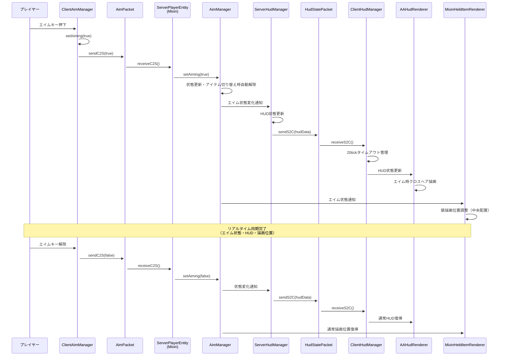
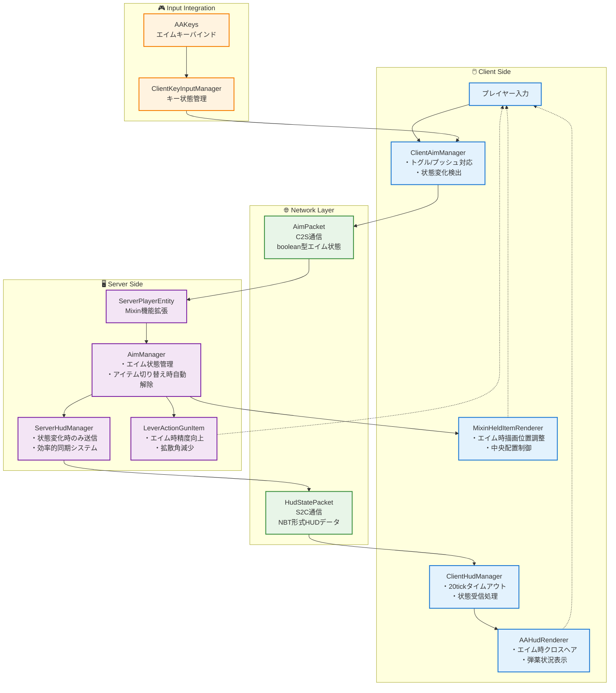

# エイム機能統合システム詳細

## 概要

このドキュメントは、ActionArms MODのエイム機能がどのように他のシステムと連携してリアルタイム同期を実現しているかを詳細に説明します。実装調査パターンガイドの「機能連携調査」パターンを適用した実例です。

## システム構成要素

### 調査起点（知識の泉より）

```json
// client.json から
"ClientAimManager.java": {
  "desc": "クライアント側エイム管理とトグル・プッシュ両対応",
  "dependencies": ["AimPacket.java", "HasAimManager.java"]
}

// network.json から  
"AimPacket.java": {
  "desc": "エイム状態をクライアントからサーバーに同期するパケット",
  "dependencies": ["HasAimManager.java", "ClientAimManager.java"]
}
```

## エイム機能連携フロー

### 1. リアルタイム同期シーケンス



### 2. エイム機能統合アーキテクチャ



## 技術的実装詳細

### 1. ClientAimManager の状態管理

```java
// 実装パターン例（documentation-creation-guide.md より）
public class ClientAimManager {
    private boolean aiming = false;
    private boolean toggleMode = false; // 設定により切り替え可能
    
    public void setAiming(boolean aiming) {
        if (this.aiming != aiming) {
            this.aiming = aiming;
            AimPacket.sendC2S(aiming); // 即座にサーバー同期
        }
    }
    
    // トグル・プッシュ両対応
    public void handleAimInput(boolean keyPressed) {
        if (toggleMode) {
            if (keyPressed) setAiming(!aiming); // トグル
        } else {
            setAiming(keyPressed); // プッシュ
        }
    }
}
```

### 2. ネットワーク効率化

```java
// HudStatePacket の効率化実装
public class ServerHudManager {
    // 状態変化時のみ送信（効率化）
    public void updateHud(ServerPlayerEntity player, String stateId, HudState<?> newState) {
        HudState<?> oldState = getState(player, stateId);
        if (!Objects.equals(oldState, newState)) {
            HudStatePacket.sendS2C(player, stateId, newState);
            setState(player, stateId, newState);
        }
    }
}
```

### 3. Mixin統合パターン

```java
// MixinHeldItemRenderer でのエイム時描画制御
@Mixin(HeldItemRenderer.class)
public class MixinHeldItemRenderer {
    @Inject(method = "applyEquipOffset", at = @At("HEAD"), cancellable = true)
    public void onApplyEquipOffset(CallbackInfo ci) {
        if (isPlayerAiming() && isGltfModelItem()) {
            // エイム時の中央配置
            applyAimingOffset();
            ci.cancel(); // デフォルト処理をキャンセル
        }
    }
}
```

## パフォーマンス特性

### 1. ネットワーク効率

| 項目 | 従来システム | エイム機能統合 |
|------|-------------|-------------|
| エイム状態同期 | 毎tick送信 | 変化時のみ |
| HUD更新 | 強制送信 | 差分のみ |
| データサイズ | 大きい | 最小限（boolean） |
| レスポンス | 遅延あり | 即座 |

### 2. メモリ使用量

```
エイム状態: boolean 1bit
HUD状態: NBTCompound（必要分のみ）
タイムアウト管理: 20tick（1秒）自動クリーンアップ
```

## トラブルシューティング

### よくある問題と解決法

| 問題 | 原因 | 解決方法 |
|------|------|---------|
| エイム状態が同期されない | ネットワークパケット登録漏れ | Networking.java でのパケット登録確認 |
| HUDが更新されない | ServerHudManager の状態変化検出漏れ | 状態比較ロジックの確認 |
| 描画位置がずれる | MixinHeldItemRenderer の条件分岐 | エイム状態判定の確認 |
| エイムが自動解除される | AimManager のアイテム切り替え検出 | 意図的な動作（仕様） |

## 拡張ポイント

### 将来的な機能追加

1. **スコープ機能**: エイム時のズーム機能
2. **呼吸エフェクト**: エイム時の視点ブレ
3. **疲労システム**: 長時間エイム時の精度低下
4. **カスタムクロスヘア**: プレイヤー設定可能なクロスヘア

### 実装時の考慮点

```java
// 拡張時のパターン
public interface AdvancedAimManager extends AimManager {
    void setZoomLevel(float zoom);
    void applyFatigueEffect(float fatigue);
    void setCustomCrosshair(CrosshairType type);
}
```

## まとめ

このエイム機能統合システムは、以下の原則に基づいて設計されています：

1. **リアルタイム性**: 即座の状態同期
2. **効率性**: 変化時のみの通信
3. **拡張性**: 将来機能への対応
4. **統合性**: 他システムとの密な連携

この実装により、マルチプレイヤー環境でも遅延のないエイム体験と視覚的フィードバックを実現しています。

---

**作成日**: 2025-06-19  
**調査パターン**: 機能連携調査（implementation-investigation-patterns.md）  
**情報源**: 知識の泉（client.json, network.json, root.json）  
**関連ドキュメント**: system-overview.md