# ActionArms システム概要図

## プロジェクト全体アーキテクチャ

このドキュメントは、ActionArms MODプロジェクトの全体的なシステム構造を視覚的に表現します。

### システム全体図

```mermaid
graph TB
    subgraph "🔧 Core Systems"
        MAIN[ActionArms.java<br/>MODメインクラス]
        REG[Registration.java<br/>アイテム・エンティティ登録]
        NET[Networking.java<br/>ネットワーク通信管理]
        CONFIG[AAConfig.java<br/>設定管理]
    end
    
    subgraph "🔫 Item System"
        LEVER[LeverActionGunItem<br/>レバーアクション銃アイテム]
        COMP[LeverActionGunComponent<br/>銃機構コンポーネント]
        BULLET[BulletItem<br/>弾丸アイテム]
        UNIQUE[UniqueComponent<br/>アイテム個体識別]
        CHAMBER[Chamber<br/>薬室]
        MAGAZINE[MagazineComponent<br/>マガジン]
    end
    
    subgraph "🎨 Rendering System"
        GLTF[GltfRenderer<br/>glTF描画エンジン]
        DIRECT[DirectProcessor<br/>最適化処理]
        CONTEXT[RenderingContext<br/>描画状態管理]
        MANAGER[GltfModelManager<br/>モデル管理]
        CONVERTER[GltfModelConverter<br/>変換処理]
    end
    
    subgraph "💻 Client Systems"
        AIM[ClientAimManager<br/>エイム管理]
        KEY[ClientKeyInputManager<br/>キー入力管理]
        HUD[AAHudRenderer<br/>HUD描画]
        CLIENT[ActionArmsClient<br/>クライアント初期化]
    end
    
    subgraph "🎯 Entity System"
        ENTITY[BulletEntity<br/>弾丸エンティティ]
        PHYSICS[Physics Engine<br/>物理演算]
        COLLISION[Collision Detection<br/>当たり判定]
    end
    
    subgraph "🌐 Network System"
        KEYPACKET[KeyInputPacket<br/>キー入力同期]
        AIMPACKET[AimPacket<br/>エイム状態同期]
        HUDPACKET[HudStatePacket<br/>HUD状態同期]
        RECOILPACKET[RecoilPacket<br/>リコイル同期]
        ANIMPACKET[ItemAnimationEventPacket<br/>アニメーション同期]
    end
    
    subgraph "🎪 Mixin Integration"
        MIXINPLAYER[MixinPlayerEntity<br/>プレイヤー機能拡張]
        MIXINRENDERER[MixinHeldItemRenderer<br/>アイテム描画カスタム]
        MIXINHUD[MixinInGameHud<br/>HUD統合]
        MIXINITEM[MixinItemRenderer<br/>アイテム描画制御]
    end
    
    %% Core connections
    MAIN --> REG
    MAIN --> NET
    MAIN --> CONFIG
    
    %% Item system connections
    REG --> LEVER
    REG --> BULLET
    LEVER --> COMP
    COMP --> CHAMBER
    COMP --> MAGAZINE
    COMP --> UNIQUE
    
    %% Rendering connections
    LEVER --> GLTF
    GLTF --> DIRECT
    GLTF --> CONTEXT
    MANAGER --> CONVERTER
    CONVERTER --> GLTF
    
    %% Client system connections
    CLIENT --> AIM
    CLIENT --> KEY
    CLIENT --> HUD
    
    %% Entity connections
    LEVER --> ENTITY
    ENTITY --> PHYSICS
    ENTITY --> COLLISION
    
    %% Network connections
    NET --> KEYPACKET
    NET --> AIMPACKET
    NET --> HUDPACKET
    NET --> RECOILPACKET
    NET --> ANIMPACKET
    KEY --> KEYPACKET
    AIM --> AIMPACKET
    HUD --> HUDPACKET
    
    %% Mixin connections
    MIXINPLAYER --> AIM
    MIXINPLAYER --> KEY
    MIXINRENDERER --> GLTF
    MIXINHUD --> HUD
    MIXINITEM --> GLTF
    
    %% Style definitions
    classDef coreStyle fill:#e1f5fe,stroke:#01579b,stroke-width:2px
    classDef itemStyle fill:#f3e5f5,stroke:#4a148c,stroke-width:2px
    classDef renderStyle fill:#e8f5e8,stroke:#1b5e20,stroke-width:2px
    classDef clientStyle fill:#fff3e0,stroke:#e65100,stroke-width:2px
    classDef entityStyle fill:#fce4ec,stroke:#880e4f,stroke-width:2px
    classDef networkStyle fill:#e0f2f1,stroke:#004d40,stroke-width:2px
    classDef mixinStyle fill:#f1f8e9,stroke:#33691e,stroke-width:2px
    
    class MAIN,REG,NET,CONFIG coreStyle
    class LEVER,COMP,BULLET,UNIQUE,CHAMBER,MAGAZINE itemStyle
    class GLTF,DIRECT,CONTEXT,MANAGER,CONVERTER renderStyle
    class AIM,KEY,HUD,CLIENT clientStyle
    class ENTITY,PHYSICS,COLLISION entityStyle
    class KEYPACKET,AIMPACKET,HUDPACKET,RECOILPACKET,ANIMPACKET networkStyle
    class MIXINPLAYER,MIXINRENDERER,MIXINHUD,MIXINITEM mixinStyle
```



## システム詳細説明

### 🔧 Core Systems
**役割**: MOD全体の基盤機能
- **ActionArms.java**: MODのエントリーポイント、初期化処理
- **Registration.java**: アイテム・エンティティ・サウンドの登録管理
- **Networking.java**: クライアント・サーバー間通信の統合管理
- **AAConfig.java**: MOD設定とCloth Config連携

### 🔫 Item System
**役割**: 銃とコンポーネントベースのアイテム管理
- **LeverActionGunItem**: レバーアクション銃の基本実装
- **LeverActionGunComponent**: 銃の状態管理と機能実装
- **Chamber/MagazineComponent**: 弾薬管理システム
- **UniqueComponent**: アイテム個体識別システム

### 🎨 Rendering System
**役割**: 高性能なglTF 3Dモデル描画
- **GltfRenderer**: 3つの描画モード対応メインレンダラー
- **DirectProcessor**: 中間オブジェクト削除による最適化
- **RenderingContext**: イミュータブルな描画状態管理
- **GltfModelManager**: リソース管理とキャッシング

### 💻 Client Systems
**役割**: クライアント側の専用機能
- **ClientAimManager**: エイム機能（トグル・プッシュ対応）
- **ClientKeyInputManager**: 専用キーバインドシステム
- **AAHudRenderer**: 弾薬状況の視覚的表示
- **ActionArmsClient**: クライアント初期化

### 🎯 Entity System
**役割**: 物理演算付き弾丸システム
- **BulletEntity**: 重力・空気抵抗・当たり判定付き弾丸
- **Physics Engine**: リアルな弾道計算
- **Collision Detection**: ヘッドショット判定システム

### 🌐 Network System
**役割**: マルチプレイヤー対応のリアルタイム同期
- **各種Packet**: 効率的なC2S/S2C通信
- **リアルタイム同期**: エイム・キー入力・HUD・リコイル・アニメーション

### 🎪 Mixin Integration
**役割**: Minecraftへの非侵襲的統合
- **プレイヤー機能拡張**: エイム・キー入力機能の注入
- **描画カスタマイズ**: glTFモデルとHUDの統合
- **動作制御**: デフォルト動作の置き換え

## データフロー概要

### 1. 銃の操作フロー
```
キー入力 → ClientKeyInputManager → KeyInputPacket → 
ServerPlayerEntity → GunController → LeverActionGunComponent → 
射撃/リロード/サイクル処理
```

### 2. 描画フロー
```
.glbファイル → GltfModelManager → GltfModelConverter → 
ProcessedGltfModel → GltfRenderer → DirectProcessor → 
OpenGL描画
```

### 3. 同期フロー
```
クライアント状態変更 → 各種Packet → サーバー処理 → 
状態更新 → 他クライアントへ同期
```

## 技術的特徴

### 🚀 パフォーマンス最適化
- **DirectProcessor**: 中間オブジェクト100%削除
- **ThreadLocal メモリプール**: アロケーション90%削減
- **効率的ネットワーク**: 変化時のみ送信

### 🔧 設計原則
- **コンポーネントベース**: 柔軟な機能拡張
- **イミュータブル設計**: 副作用ゼロレンダリング
- **インターフェース分離**: 疎結合なシステム構成

### 🎯 Minecraft統合
- **Mixin活用**: 非侵襲的な機能追加
- **Architectury対応**: Fabric・Forge両対応
- **リソースパック**: glTFモデルとテクスチャ管理

---

このシステム概要図は、ActionArms MODの複雑なアーキテクチャを理解するための出発点として活用してください。詳細な実装については、各システムの個別ドキュメントを参照してください。

**作成日**: 2025-06-19  
**情報源**: 知識の泉 (files-index.json, common/*.json)  
**ガイドライン**: architecture-diagram-guidelines.md